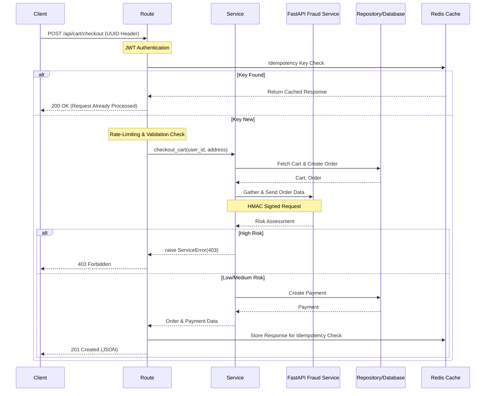

## Overview

A containerized, monolithic production-style REST API that simulates the backend of an e-commerce platform. It provides authentication, product management, shopping cart functionality, order processing, payment and delivery webhook simulation and admin endpoints. The project focuses on backend architecture, database design, system reliability features (such as idempotent requests and webhook security) and performance (N+1 query optimization, Redis caching).

---

## Tech Stack

- **Backend:** Python, Flask, Marshmallow, SQLAlchemy 2.0 (App Factory Pattern)
- **Architecture:** Repository Pattern (Routes/Services/Repositories)
- **Infrastructure:**
  - **Local:** SQLite, FakeRedis
  - **Production:** Docker, PostgreSQL, Redis
- **Security:** JWT Authentication, HMAC Webhook Signatures, Bcrypt Hashing
- **Testing:** Pytest

---

## Installation & Setup

There are 2 different options provided depending on if you want to run the app through Docker or locally.

### Option 1: Docker (Recommended):

If you want to launch the entire eCommerce ecosystem, including the [Fraud Check microservice](https://github.com/ncokic/fastapi-fraud-check-microservice) that this project is integrated with, follow the optional step first:

#### (Optional) Set up shared network and Fraud Check microservice container:

```bash
# 1. Create the shared network:
docker network create ecommerce_shared_net

#2 Clone the Fraud Check microservice repo:
git clone https://github.com/ncokic/fastapi-fraud-check-microservice.git
cd fastapi-fraud-check-microservice

#3. Create environment file from the provided example
# Make sure that the shared key matches in both apps (see .env.example for more details)
cp .env.example .env

#4. Build container and exit the project folder
make up
# OR
docker-compose up --build -d # Windows

cd ..
```

#### (Mandatory) Launch the eCommerce API, PostgreSQL database and Redis cache containers:

```bash
#1. Clone the repo:
git clone https://github.com/ncokic/flask-ecommerce-api.git
cd flask-ecommerce-api

# 2. Create environment file from the provided example
cp .env.example .env

# 3. Set up Docker containers
make up
# OR
docker-compose up --build -d # Windows

# 4. Initialize the database and seed initial testing data
make setup
# OR
docker-compose exec web flask setup # Windows
```

### Option 2: Local Development
This approach will run the app locally on your host machine using SQLite as database and FakeRedis for caching.

```bash
# 1. Create a virtual environment
python -m venv venv

# 2. Activate the created virtual environment
source venv/bin/activate
# OR
venv\Scripts\Activate.ps1 # Windows

# 3. Install dependencies
python -m pip install -r requirements.txt

# 4. Create your environment file from the provided example
cp .env.example .env

# 5. Run the setup script to create tables and seed database with test product + user data
flask setup

# 6. Start the server
flask run
```

Note: Flask app is designed to fail gracefully if for some reason it cannot communicate with the FastAPI fraud check service - it defaults to low-risk assessment rather than crashing the whole system.

---

## Architecture

The project follows a layered repository pattern architecture designed for separation of concerns. Below is a sequence diagram illustrating how a request travels through the app layers using a cart checkout endpoint as an example.



Key architectural decisions:

- **Application Factory pattern** for flexible app initialization
- **Blueprint-based routing** for modular API structure
- **Thin controllers/fat services** design
- **Request/Response schemas** using Marshmallow
- **Decorators** for production-ready backend features
- **Consistent API responses** through a custom helper function
- **Global error handling** returning the same helper function for consistency

---

## Key Highlights

### Fraud Detection Microservice Integration

This project integrates with a [FastAPI fraud detection microservice:](https://github.com/ncokic/fastapi-fraud-check-microservice)

- During checkout, Flask API sends order/user metadata to the fraud service.
- The service evaluates risk using a locally trained ML model + set of guardrails.
- High-risk orders are rejected while medium-risk orders are flagged for manual admin review.
- Incorporates graceful degradation, defaulting to low-risk assessment which ensures that the core functionality of the eCommerce app is maintained even if the fraud service is down.

### Idempotent Requests

Implemented a custom @idempotent_route decorator using Redis to cache idempotency keys. This ensures that critical operations (checkout, refunds, webhooks) are processed exactly once, even if the user retries the request. Requires a UUID4 "Idempotency-Key" header.

### Secure Webhooks

External communication endpoints are secured using HMAC SHA-256 signature validation to ensure authenticity and integrity of incoming data.

### Rate Limiting

High traffic routes are protected with rate limits to prevent abuse.

### N+1 Query Resolution

Identified N+1 issues by examining database transactions using SQLAlchemy logging and resolved them by implementing eager loading ('selectinload' and 'joinedload') for relationship-heavy endpoints such as order listing.

### DX Features

The project includes several development tools to simplify testing and environment setup.

- **Custom CLI commands** that allow: database reset, seeding test data, clearing idempotency keys, as well as admin account creation.
- **Script** for generating webhook HMAC signatures and UUID4 idempotency keys for testing purposes.
- **Makefile** for common development commands such as: building containers, running tests, viewing logs, resetting the database.

### Docker Setup

The application is fully containerized using Docker and Docker Compose. Containers include:
- Flask application
- PostgreSQL database
- Redis instance

---

## Testing

The testing covers API endpoints, authentication, services, repositories and business logic.

- **94% Code Coverage**: 130 unit and integration tests using pytest.
- **Dependency Injection**: Utilized FakeRedis to mock Redis during testing ensuring the test suites remain fast and isolated from infrastructure.

---

## API Documentation

Interactive Swagger documentation using Flask-Smorest which is generated as the app's home page.

## Project Goals

This project was built as part of my backend development portfolio to practice:

- REST API design
- backend architecture patterns
- database modeling
- authentication and authorization
- production-ready backend features
- containerized application development

## Future Improvements

Possible future improvements to add to the project:

- payment provider integration
- automatic email sending on refund request acceptance
- cloud deployment

## Contact

If you have any questions about the project feel free to reach out:

[](mailto:ncokic248@gmail.com)