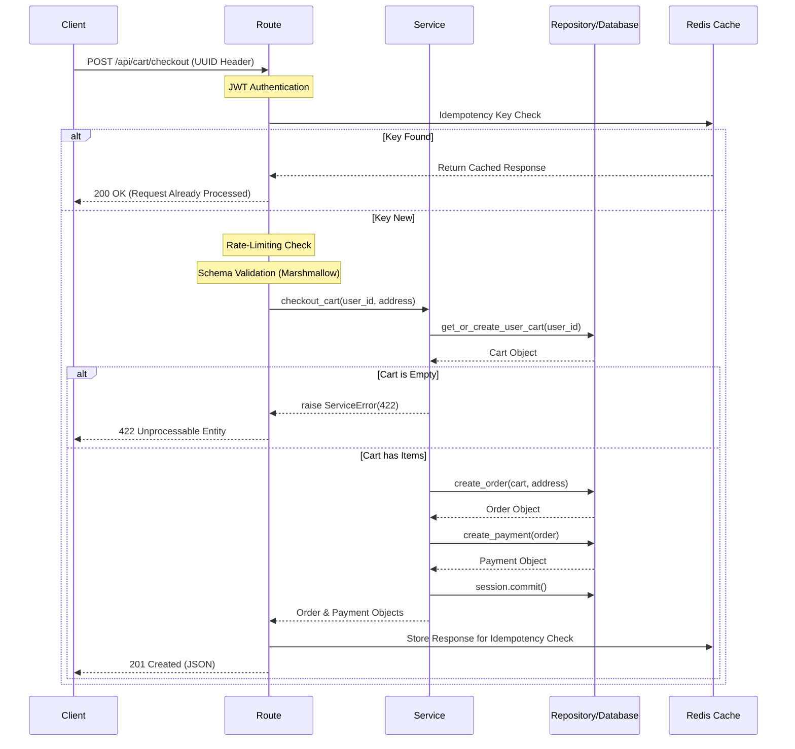

## Overview

A containerized, production-style REST API that simulates the backend of an e-commerce platform. It provides authentication, product management, shopping cart functionality, order processing, payment and delivery webhook simulation and admin endpoints. The project focuses on backend architecture, database design, system reliability features (such as idempotent requests and webhook security) and performance (N+1 query optimization, Redis caching).

---

## Tech Stack

- **Backend:** Python, Flask, Marshmallow, SQLAlchemy 2.0 (App Factory Pattern)
- **Architecture:** Repository Pattern (Routes/Services/Repositories)
- **Infrastructure:**
  - **Local:** SQLite, FakeRedis
  - **Production:** Docker, PostgreSQL, Redis
- **Security:** JWT Authentication, HMAC Webhook Signatures, Bcrypt Hashing
- **Testing:** Pytest

---

## Installation & Setup

### Option 1: Docker (Recommended):
This approach automatically sets up the API, PostgreSQL database and Redis cache containers.

```bash
# 1. Clone the repo
git clone https://github.com/ncokic/flask-ecommerce-api.git
cd flask-ecommerce-api

# 2. Create your environment file from the provided example
cp .env.example .env

# 3. Set up Docker containers
make up # or  docker-compose up --build -d  if on Windows

# 4. Initialize the database and seed initial testing data
make setup # or  docker-compose exec web flask setup  if on Windows
```

### Option 2: Local Development
This approach will run the app locally on your host machine using SQLite as database and FakeRedis for caching.

```bash
# 1. Create a virtual environment
python -m venv venv
source venv/bin/activate # or  venv\Scripts\activate.bat  if on Windows

# 2. Install dependencies
pip install -r requirements.txt

# 3. Configure your .env from the provided .env.example

# 4. Run the setup script
flask setup

# 5. Start the server
flask run
```

---

## Architecture

The project follows a layered repository pattern architecture designed for separation of concerns. Below is a sequence diagram illustrating how a request travels through the app layers using a cart checkout endpoint as an example.



Key architectural decisions:

- **Application Factory pattern** for flexible app initialization
- **Blueprint-based routing** for modular API structure
- **Thin controllers/fat services** design
- **Request/Response schemas** using Marshmallow
- **Decorators** for production-ready backend features
- **Consistent API responses** through a custom helper function
- **Global error handling** returning the same helper function for consistency

---

## Key Highlights

### Idempotent Requests

Implemented a custom @idempotent_route decorator using Redis to cache idempotency keys. This ensures that critical operations (checkout, refunds, webhooks) are processed exactly once, even if the user retries the request. Requires a UUID4 "Idempotency-Key" header.

### Secure Webhooks

External communication endpoints are secured using HMAC SHA-256 signature validation to ensure authenticity and integrity of incoming data.

### Rate Limiting

High traffic routes are protected with rate limits to prevent abuse.

### N+1 Query Resolution

Identified N+1 issues by examining database transactions using SQLAlchemy logging and resolved them by implementing eager loading ('selectinload' and 'joinedload') for relationship-heavy endpoints such as order listing.

### DX Features

The project includes several development tools to simplify testing and environment setup.

- **Custom CLI commands** that allow: database reset, seeding test data, clearing idempotency keys, as well as admin account creation.
- **Script** for generating webhook HMAC signatures and UUID4 idempotency keys for testing purposes.
- **Makefile** for common development commands such as: building containers, running tests, viewing logs, resetting the database.

### Docker Setup

The application is fully containerized using Docker and Docker Compose. Containers include:
- Flask application
- PostgreSQL database
- Redis instance

---

## Testing

The testing covers API endpoints, authentication, services, repositories and business logic.

- **94% Code Coverage**: 113 unit and integration tests using pytest.
- **Dependency Injection**: Utilized FakeRedis to mock Redis during testing ensuring the test suites remain fast and isolated from infrastructure.

---

## API Documentation

Interactive Swagger documentation using Flask-Smorest which is generated as the app's home page.


## Project Goals

This project was built as part of my backend development portfolio to practice:

- REST API design
- backend architecture patterns
- database modeling
- authentication and authorization
- production-ready backend features
- containerized application development

## Future Improvements

Possible future improvements to add to the project:

- payment provider integration
- automatic email sending on refund request acceptance
- cloud deployment

## Contact

If you have any questions about the project feel free to reach out:

[](mailto:ncokic248@gmail.com)